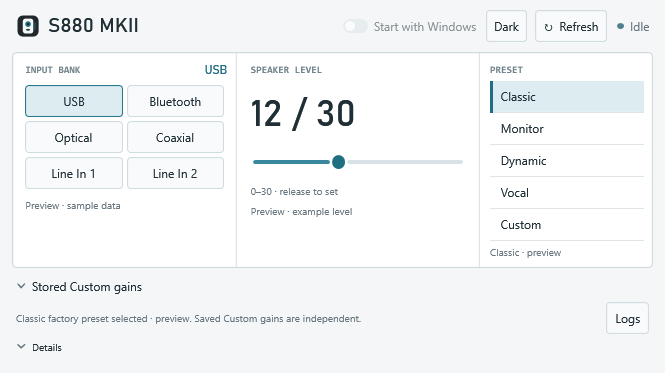
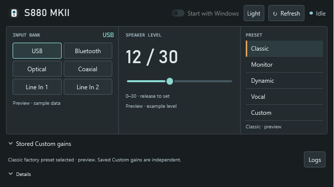
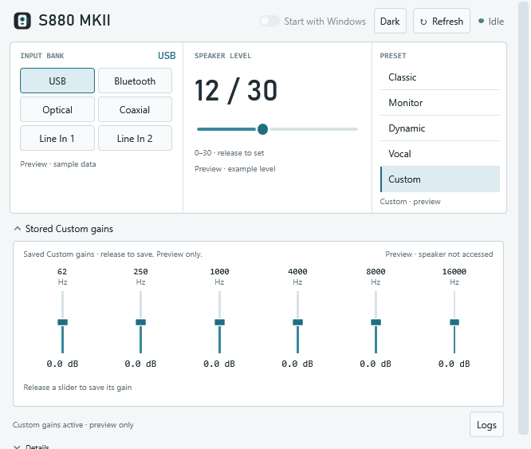

# EDIFIER S880 MKII — Windows Speaker Controller

A compact Windows controller for the **EDIFIER S880 MKII**, using your computer's Bluetooth adapter. Change inputs, adjust speaker volume, select sound presets, and edit the saved six-band Custom EQ from one small desktop panel.

This project targets the **China-market S880 MKII that uses EDIFIER Connect**. The international **EDIFIER ConneX** app does not discover this variant. Other speaker models and firmware variants have not been validated. This is an independent project, not an official EDIFIER application.

**Taskbar tray shortcut:** single-click for USB, double-click to open the panel, and right-click for the menu. See [Taskbar tray controls](#taskbar-tray-controls).

## Screenshots

Light is the default theme. The images below are renders of the actual WPF interface with example values; they do not contain device logs or personal desktop content.

### Light



### Dark



### Saved Custom EQ



## Features

- **Automatic first read:** opening the panel reads the input, preset, saved Custom gains, and volume. Reopening the panel preserves pending edits.
- **Six inputs:** USB, Bluetooth, Optical, Coaxial, Line In 1, and Line In 2.
- **Speaker volume:** 0–30, applied when you release the slider and confirmed by device readback.
- **Sound presets:** Classic, Monitor, Dynamic, Vocal, and Custom.
- **Saved Custom EQ:** six bands at 62, 250, 1000, 4000, 8000, and 16000 Hz; gains from −3 to +3 dB in 0.5 dB steps. Changing a gain selects Custom after confirmation.
- **Tray controls:** single-click switches to USB; double-click opens the panel; right-click opens the menu. The single-click action waits for the Windows double-click interval.
- **Start with Windows:** launch quietly in the tray when signing in. The first panel opening triggers the initial read.
- **Light and dark themes**, compact native WPF layout, and short animations that respect Windows reduced-motion settings.
- **One-click USB helper** and a CLI for discovery, queries, and supported controls.

Factory presets and saved Custom values are separate. The speaker does not expose a verified six-band curve for each factory preset, so the editor does not invent one.

## Taskbar tray controls

Use the small speaker icon in the Windows taskbar notification area, beside the clock. If it is hidden, open the tray overflow menu to find it.

| Action | What happens |
| --- | --- |
| **Single left-click** | Switches the speaker directly to **USB**, without opening the panel. |
| **Double left-click** | Opens or restores the control panel and cancels the pending single-click USB action. |
| **Right-click** | Opens the menu: show the panel, choose an input, refresh status, or exit. |

The USB action waits briefly for the Windows double-click interval, so a double-click can open the panel without first switching inputs. Closing the window with **X** keeps the controller running in the tray; choose **Exit** from the right-click menu to quit.

## Requirements

- Windows x64 with a working Bluetooth/BLE adapter.
- A compatible EDIFIER S880 MKII using **EDIFIER Connect**.
- .NET SDK **10.0.301** or a compatible patch for building (`global.json`).
- .NET **10 Desktop Runtime x64** to run a lightweight build. The runtime is separate from the application.

The project has been exercised on Windows 11. Its Windows API target is Windows 10 version 2004 or later; that does not represent a full compatibility test on every Windows release or adapter.

## Build and test

```powershell
git clone https://github.com/darknight105/edifier-s880-mkii-controller.git
cd edifier-s880-mkii-controller
dotnet build .\S880Controller.slnx -c Release --disable-build-servers -m:1
dotnet run --project .\tests\S880Ctl.Tests\S880Ctl.Tests.csproj -c Release --no-build
```

The test project is an executable test suite. Use `dotnet run` as shown; an empty `dotnet test` result is not a successful run of this suite.

This initial public distribution is source-only; there is no universal prebuilt binary. The public source contains no personal speaker address. An unconfigured build supports offline tests and previews; speaker control requires an explicit device binding at build time.

## Build for your speaker

Find your speaker's public Bluetooth address, then supply it when publishing:

```powershell
.\scripts\publish-lightweight.ps1 -SpeakerAddress 'AA:BB:CC:DD:EE:FF'
```

Replace the example address with your own. The resulting package is bound to that address, while the controller still verifies the expected GATT service and the `EDIFIER S880 MKII` identity before sending setting commands. The default package output is `artifacts/lightweight`.

The lightweight package includes one user-facing controller EXE with its backend and model profile embedded, plus the optional USB launcher. Its .NET runtime remains separate. The internal backend is extracted into a local cache when needed. Build output is excluded from Git because it contains the selected device binding.

Exit any earlier controller build before opening your new package. Open `S880Controller.exe`. After the initial read finishes, the input, preset, and volume become available. Use **Refresh** after changing settings with the remote or phone. Closing the panel keeps the application in the tray; use **Exit** to quit.

Keep `Switch to USB.vbs` beside the EXE. A generated `.lnk` shortcut refers to its build location; after moving the folder, use the VBS helper directly or recreate the shortcut.

## Connecting

EDIFIER Connect can retain the speaker's control session after its page is closed. If Windows cannot connect, use **Force Stop** for EDIFIER Connect in Android settings and retry.

The verified recovery sequence is to select Bluetooth with the physical remote, allow phone audio to connect, and keep EDIFIER Connect force-stopped. Windows can then select USB. Availability after cold power-on into USB or a long idle period may depend on the speaker and adapter; it has not been established across devices.

## Validation and limits

See [publication validation](docs/validation.md) for the checks performed on the public source.

Development builds tested on one local speaker confirmed input switching, all five preset selections, six-band Custom reads, a Custom gain write and restoration, and volume reads/writes. The GUI startup change automatically read USB, Classic, saved Custom gains, and volume 12/30 without a Refresh click. The public build-time binding is checked separately with synthetic addresses and offline tests; it is not a multi-device hardware compatibility result.

Automated checks cover protocol frames, input validation, identity checks, write confirmation, volume/gain behavior, portable payload hashes, tray gestures, first-open refresh, failure recovery, serialized operations, and single-instance window activation. Offline checks use simulated backends and do not contact a speaker.

This is not a claim of compatibility with every S880 MKII unit. Acoustic preset curves, every external audio input, adapter resets, long-running tray behavior, and native pointer input at every DPI have not been comprehensively tested. Standby, wake, firmware updates, USB-driver changes, arbitrary BLE writes, and Custom frequency/Q/name editing are not implemented.

## Project layout

| Path | Purpose |
| --- | --- |
| `src/S880Tray` | WPF GUI, tray actions, startup registration, and embedded backend management |
| `src/S880Ctl` | Windows Bluetooth access, device identity checks, and the supported protocol commands |
| `tests/S880Ctl.Tests` | Executable protocol and command validation suite |
| `profiles` | Public model/protocol profile |
| `scripts` | Device-bound publishing and the USB launcher |
| `docs/images` | Interface screenshots |

Phone bugreports, raw Bluetooth captures, APKs, decompiled third-party sources, local application logs, and personal device identifiers are not part of this repository.

## License

[MIT](LICENSE). EDIFIER and its product names belong to their respective owners.